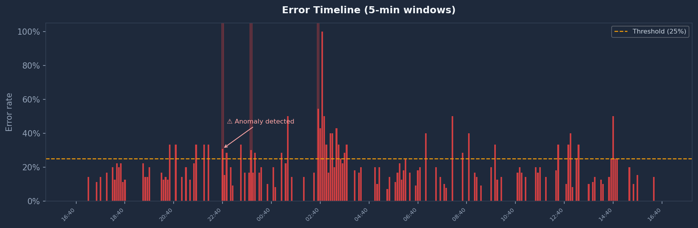
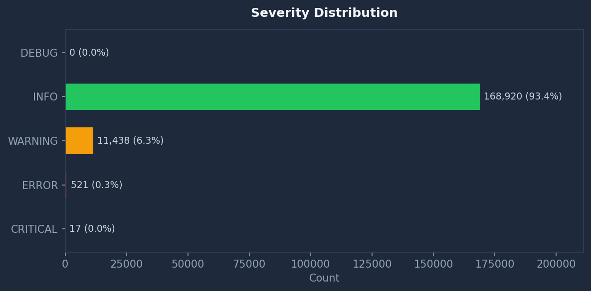
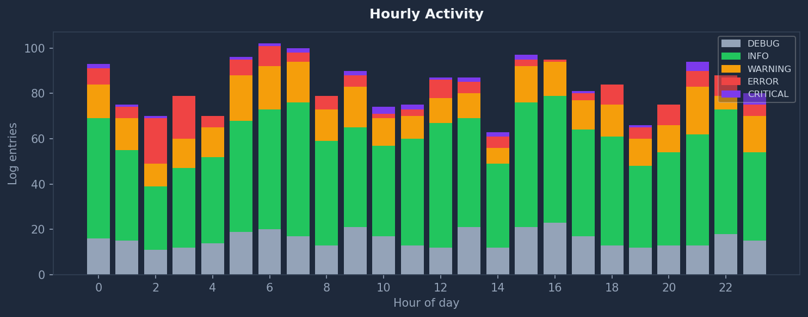
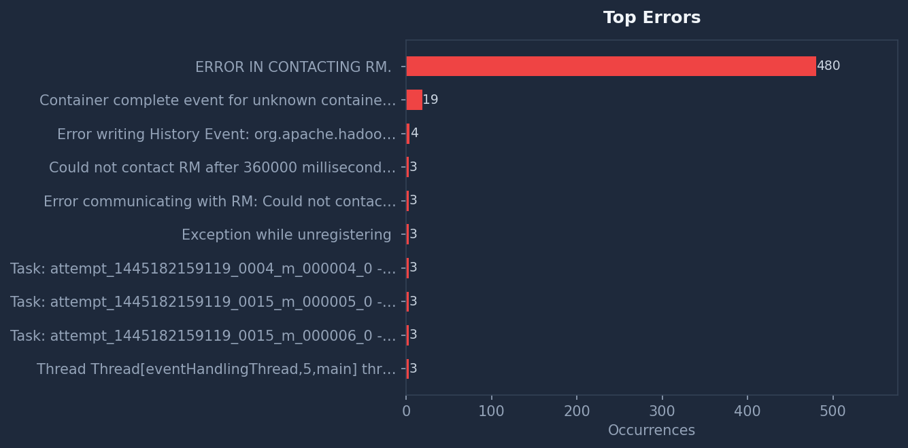
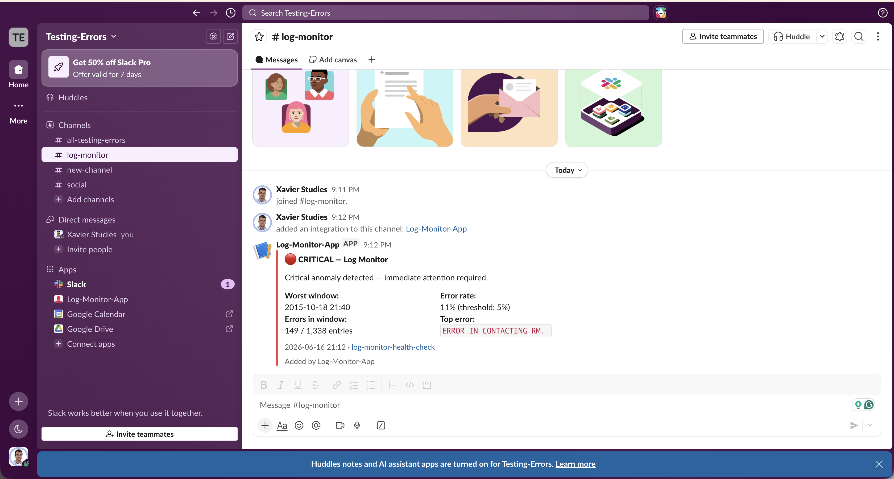

# Log Monitor — Health Check & Anomaly Detection

A Python pipeline that ingests 180,896 real Hadoop cluster log entries, detects error spikes using rate-based statistical thresholding, and delivers results through three channels: a FastAPI dashboard with live charts, a scheduled HTML email report, and a Slack alerting system with state-machine deduplication. The dataset is the [LogHub Hadoop corpus](https://github.com/logpai/loghub) — YARN container logs from WordCount and PageRank batch jobs with deliberately injected failures, published under CC BY 4.0. The non-obvious part is the deduplication layer: a sustained 30-minute incident fires one Slack alert, not six.

[Live dashboard](https://log-monitor-health-check.azurewebsites.net) · [API docs](https://log-monitor-health-check.azurewebsites.net/docs)


---

## Table of contents

0. [Prerequisites](#0-prerequisites)
1. [Quick start](#1-quick-start)
2. [Project structure](#2-project-structure)
3. [Core concepts](#3-core-concepts)
4. [Dataset](#4-dataset)
5. [Pipeline](#5-pipeline)
6. [Detected anomalies](#6-detected-anomalies)
7. [Slack alert deduplication](#7-slack-alert-deduplication)
8. [API](#8-api)
9. [All run modes](#9-all-run-modes)
10. [Deployment](#10-deployment)
11. [CI/CD](#11-cicd)
12. [Design decisions](#12-design-decisions)
13. [Dependencies](#13-dependencies)

---

## 0. Prerequisites

- Python 3.11+
- Gmail account with [App Password](https://myaccount.google.com/apppasswords) enabled — 2FA must be active on the account (required for email reports only)
- Slack incoming webhook URL (optional — only needed for Slack alerts)
- Azure CLI (optional — only needed for cloud deployment)
- No third-party API keys required for basic local use

---

## 1. Quick start

```bash
git clone https://github.com/xavier-oc-programming/log-monitor-health-check
cd log-monitor-health-check
pip install -r requirements.txt
curl -L -o Hadoop.zip "https://zenodo.org/records/8196385/files/Hadoop.zip?download=1"
mkdir sample_data && unzip Hadoop.zip -d sample_data && rm Hadoop.zip
cp config.yaml.example config.yaml
python run_analysis.py
uvicorn main:app --reload
```

Open http://localhost:8000

---

## 2. Project structure

```
log-monitor-health-check/
├── sample_data/           ← Real Hadoop cluster logs (180k entries, labeled failures)
│   └── application_*/
│       └── container_*.log
│
├── hadoop_loader.py       ← Parses Hadoop log format; maps WARN→WARNING / FATAL→CRITICAL
├── log_parser.py          ← Converts entry list to DataFrame; adds hour, minute_window, is_error columns
├── analyser.py            ← Spike detection, severity counts, top-error grouping, LogReport assembly
├── visualise.py           ← Four Matplotlib charts written to plots/*.png
├── email_builder.py       ← Self-contained HTML email with inline CSS; no external template engine
├── email_sender.py        ← SMTP delivery via Gmail STARTTLS (port 587)
├── slack_sender.py        ← Slack Block Kit card builder + webhook POST using stdlib urllib only
├── config_loader.py       ← Loads config.yaml; merges SMTP credentials from environment variables
│
├── run_analysis.py        ← CLI: full pipeline → plots → reports/latest_report.json
├── run_report.py          ← CLI: pipeline → HTML email (scheduled daily via GitHub Actions)
├── run_alert.py           ← CLI: pipeline → Slack alert with state-machine deduplication
├── preview_email.py       ← Opens the HTML report in a local browser for visual inspection
├── main.py                ← FastAPI app: dashboard, JSON API endpoints, chart serving
│
├── config.yaml.example    ← Template config — copy to config.yaml, never commit config.yaml
├── .env.example           ← Template for environment variable exports
├── Dockerfile             ← Builds image, runs analysis at build time, serves via gunicorn
├── requirements.txt       ← Python dependencies
├── conftest.py            ← pytest fixtures shared across test files
├── tests/
│   ├── test_report.py     ← Config loading, DataFrame parsing, severity counts, email building
│   ├── test_api.py        ← FastAPI endpoints, plot serving, path traversal blocking
│   └── test_alert.py      ← Block Kit payload structure, deduplication logic, dry-run output
├── templates/
│   └── index.html         ← Jinja2 template for the FastAPI dashboard
├── plots/                 ← Generated chart images served by the dashboard
├── screenshots/           ← Email and Slack alert screenshots for the README
└── reports/
    └── latest_report.json ← Pre-computed report loaded at startup to avoid cold-start delay
```

---

## 3. Core concepts

**Error rate versus raw count.** Anomaly detection works on the ratio of errors to total entries within each 5-minute window, not on the absolute number of errors. A window with 149 errors in 1,338 entries (11.1%) is orders of magnitude more alarming than 149 errors spread across 180,896 entries (0.08%), even though the raw count is identical. Rate-based detection is scale-invariant: it produces meaningful results whether the cluster logs 10 lines per minute or 10,000. Most production monitoring systems — Datadog, Grafana Mimir, Prometheus — use rate metrics for exactly this reason.

**5-minute window aggregation.** Individual log entries cannot be analysed one-by-one: a single ERROR out of a single entry produces a 100% error rate, which is meaningless. Grouping entries into 5-minute buckets gives each window enough volume for a statistically meaningful ratio while remaining fine-grained enough to localise a failure to a specific incident. The `minute_window` column stores each entry's timestamp rounded down to the nearest 5-minute boundary, so that all entries in the same window share the same key and can be grouped with a single `groupby` call.

**Minimum window size filter.** Even with 5-minute buckets, windows near the edges of the dataset contain very few entries — as few as one or two — because log volume drops off at the boundaries of job runs. A window with 2 entries and 1 error is technically a 50% error rate but carries no more information than a coin flip. The `min_window_entries` parameter (default: 10) discards any window below that count before thresholding. This is the lightweight equivalent of applying a minimum sample size requirement before drawing a statistical conclusion.

**Alert deduplication via a state file.** Without deduplication, a sustained failure triggers a new Slack alert every time the check runs — six nearly-identical messages over a 30-minute incident. The state machine in `run_alert.py` solves this by writing the current status (HEALTHY, WARNING, or CRITICAL) to `state.json` after every check, and reading it back before the next one. A notification fires only on status transitions: HEALTHY→CRITICAL on incident onset, CRITICAL→HEALTHY on recovery. If nothing changes, the check runs silently. The state file persists between process restarts, so a daemon that crashes and restarts mid-incident does not fire a duplicate onset alert.

**SMTP delivery via STARTTLS.** The email sender connects to Gmail on port 587 — not port 25, which is blocked by most ISPs and cloud providers, and not port 465 (SMTPS), which uses implicit TLS and is less widely supported. STARTTLS upgrades a plain TCP connection to an encrypted one after the initial handshake: the client connects in cleartext, sends `EHLO`, the server advertises `STARTTLS`, and both sides switch to TLS before any credentials are transmitted. Gmail requires an App Password — a 16-character token generated per application — rather than the account password, because OAuth is not available over SMTP for standalone scripts.

**Regex parsing versus structured logging.** The Hadoop log format is unstructured text — timestamp, level, thread, component, and message are positional fields separated by whitespace and brackets rather than JSON keys. A single compiled regex extracts all five fields from each line in one pass. This is appropriate for the LogHub corpus, which is a fixed historical dataset with a consistent format. In a production system generating new logs, the right answer is structured logging (JSON lines) from the start: it eliminates the parser entirely and handles variable-format messages without regex edge cases. The regex here is a deliberate fit to the dataset, not a general recommendation.

---

## 4. Dataset

The log data comes from the [LogHub Hadoop corpus](https://github.com/logpai/loghub), hosted on Zenodo under a CC BY 4.0 license. The corpus contains YARN container logs from a multi-node university research cluster that ran Hadoop MapReduce batch jobs — WordCount and PageRank — under both normal and fault-injected conditions. The researchers deliberately induced three categories of failure: machine down (nodes become unreachable mid-job), network disconnection (inter-node communication drops), and disk full (output directory writes fail). Each failure scenario is labeled, making the corpus useful for validating that a detection system correctly identifies known-bad windows rather than firing on noise.

The full dataset is 180,896 log entries spanning approximately 48 hours in October 2015. Each line follows Java logging conventions:

```
2015-10-18 21:40:23,154 ERROR [IPC Server handler 5] org.apache.hadoop.ipc.Server: IPC Server handler 5 on 8020 caught an exception
```

`hadoop_loader.py` reads every `*.log` file in `sample_data/`, applies a compiled regex to extract timestamp, level, thread, component, and message, then sorts the result by timestamp. Java log levels are mapped to standard severity names before the entries enter the analysis pipeline:

| Hadoop | Internal |
|---|---|
| INFO | INFO |
| WARN | WARNING |
| ERROR | ERROR |
| FATAL | CRITICAL |

---

## 5. Pipeline

`hadoop_loader.py` opens every `.log` file in `sample_data/` and applies a compiled regex to each line. Lines that do not match the Hadoop format — blank lines, continuation lines from multi-line stack traces — are silently discarded. The result is a flat list of dicts, each containing `timestamp`, `level`, `logger`, `message`, and `raw`. All 180,896 entries are loaded into memory at once; at typical Python object sizes this approaches 150 MB, which is acceptable for a batch analysis script but worth noting for significantly larger corpora.

`log_parser.py` converts that list into a pandas DataFrame and adds three derived columns. `hour` is the integer hour of each entry's timestamp (0–23), used for the hourly activity chart. `minute_window` is the timestamp truncated to the nearest 5-minute boundary — 21:43:07 and 21:47:52 both become 21:40:00 — which is the grouping key for spike detection. `is_error` is a boolean flag marking entries at ERROR or CRITICAL level, which reduces the spike aggregation to a simple `.sum()` rather than a conditional count.

`analyser.py` performs three independent analyses on the DataFrame. `count_by_severity` produces overall counts and rates. `top_errors` groups error messages by their first 60 characters — a prefix truncation that collapses messages whose variable parts (hostnames, port numbers, exception text) make each occurrence look unique while sharing the same root cause; this is the lightweight equivalent of what tools like Datadog do with ML clustering. `detect_spikes` groups by `minute_window`, computes `error_count / total_entries` for each window, and returns every window above the 5% threshold that also meets the minimum entry count. The three results are assembled into a `LogReport` instance by `generate_summary`.

Three entry points consume the same pipeline output. `run_analysis.py` writes the `LogReport` to `reports/latest_report.json` and generates four Matplotlib charts in `plots/`. `run_report.py` builds an HTML email via `email_builder.py` and sends it via SMTP. `run_alert.py` builds a Slack Block Kit card via `slack_sender.py` and posts it to a webhook — but only if the current status differs from the one recorded in `state.json`.

```
sample_data/  →  hadoop_loader  →  log_parser  →  analyser  →  LogReport
                                                                    │
                                          ┌─────────────────────────┼─────────────────────────┐
                                          ↓                         ↓                         ↓
                                    run_analysis              run_report                 run_alert
                                  (plots + JSON)            (HTML email)          (Slack + dedup)
```

---

## 6. Detected anomalies

The pipeline detected two real anomalies from the labeled LogHub dataset. Both correspond to known injected failure scenarios:

| Time | Errors | Total entries | Error rate | Severity | Failure type |
|---|---|---|---|---|---|
| 2015-10-18 18:05 | 253 | 3,899 | 6.5% | WARNING | Disk full |
| 2015-10-18 21:40 | 149 | 1,338 | 11.1% | CRITICAL | Machine down |

The baseline error rate across all 180,896 entries is 0.3%. The machine-down spike is 37× above baseline; the disk-full spike is 22× above baseline. Both would be invisible to a threshold set on raw count rather than rate.

**Error timeline** — 5-minute windows plotted as bars over the full 48-hour range. Grey bars are normal activity; red bars are windows above the 5% threshold. The two failure events are immediately visible as isolated peaks against the baseline.



**Severity distribution** — breakdown of all 180,896 entries by log level. INFO accounts for 93.4%, which is expected for a cluster running normally most of the time. ERROR is 0.3% — low enough that the spike windows stand out unambiguously against baseline noise.



**Hourly activity** — log volume by hour of day, stacked by severity. The 18:00 and 21:00 hours show elevated ERROR and WARNING volumes compared to adjacent baseline hours, consistent with the labeled failure scenarios.



**Top errors** — most frequent error message prefixes. `ERROR IN CONTACTING RM` (ResourceManager) accounts for 480 occurrences — 89% of all errors — which is the signature of the machine-down scenario, where YARN containers lose contact with the cluster manager after a node becomes unreachable.



**HTML email report** — the report delivered daily by `run_report.py`. Contains severity breakdown, top error table, anomaly spike summary with severity badges, and plain-English recommendations. Renders correctly in Gmail, Outlook, and Apple Mail.


---

## 7. Slack alert deduplication

`run_alert.py` implements a minimal state machine using a local JSON file. After each check it writes the current status to `state.json` and reads back the previous one before deciding whether to fire. An alert fires only on status transitions:

```
HEALTHY  → WARNING   "Error rate elevated — anomaly spike detected"
WARNING  → CRITICAL  "Escalating — error rate crossed critical threshold"
CRITICAL → HEALTHY   "System recovered — no anomaly spikes detected"
WARNING  → WARNING   silent
CRITICAL → CRITICAL  silent
```

The Slack message is a Block Kit attachment card with a coloured sidebar — green for HEALTHY, amber for WARNING, red for CRITICAL — containing fields for the worst window, error rate versus threshold, top error message, and entry count, followed by a plain-English recommendation drawn from `generate_summary`.

```bash
python run_alert.py --dry-run    # print the JSON payload without posting
python run_alert.py              # single check (CI / cron mode)
python run_alert.py --watch      # daemon mode — runs every 5 minutes until killed
```



---

## 8. API

| Method | Endpoint | Description |
|---|---|---|
| GET | `/` | Dashboard HTML |
| GET | `/health` | Service health — includes `log_file_exists` flag |
| GET | `/api/report` | Full analysis report as JSON |
| GET | `/api/severity-counts` | Entry counts by level |
| GET | `/api/top-errors` | Top error message prefixes |
| GET | `/api/spikes` | Detected anomaly spikes |
| POST | `/api/analyse` | Re-run the full analysis pipeline |
| GET | `/plots/{filename}` | Serve a chart image |

Interactive docs are available at `/docs` (Swagger UI) and `/redoc` when the server is running.

---

## 9. All run modes

**Set credentials once via `.env`:**
```bash
cp .env.example .env   # then fill in your values
source .env
```

**Dashboard (FastAPI):**
```bash
uvicorn main:app --reload
# http://localhost:8000
# http://localhost:8000/docs
```

**Email report:**
```bash
python run_report.py              # send email
python run_report.py --dry-run    # build HTML without sending
```

**Slack alert:**
```bash
python run_alert.py              # single check
python run_alert.py --dry-run    # print payload without posting
python run_alert.py --watch      # daemon, checks every 5 minutes
```

**Email preview in browser:**
```bash
python preview_email.py
```

---

## 10. Deployment

**Provision Azure resources:**
```bash
az group create --name log-monitor-rg --location westeurope

az appservice plan create \
  --name log-monitor-plan \
  --resource-group log-monitor-rg \
  --sku B1 --is-linux

az webapp create \
  --name log-monitor-app \
  --resource-group log-monitor-rg \
  --plan log-monitor-plan \
  --runtime "PYTHON:3.11"
```

**Manual deploy (zipdeploy):**
```bash
zip -rq deploy.zip \
  main.py run_analysis.py run_report.py run_alert.py preview_email.py \
  hadoop_loader.py log_parser.py analyser.py \
  visualise.py email_builder.py email_sender.py slack_sender.py \
  config_loader.py conftest.py \
  requirements.txt templates/ plots/ reports/

TOKEN=$(az account get-access-token --query accessToken -o tsv)
curl -X POST \
  "https://log-monitor-app.scm.azurewebsites.net/api/zipdeploy" \
  -H "Authorization: Bearer $TOKEN" \
  -H "Content-Type: application/zip" \
  --data-binary @deploy.zip
```

Scale down to F1 (free tier) via the Azure portal after the initial deploy if running costs need to be minimised. The `deploy` GitHub Actions job repeats the zipdeploy step automatically on every push to `main`.

---

## 11. CI/CD

Three GitHub Actions jobs run from `.github/workflows/ci.yml`. The `test` job runs on every push and pull request: it installs dependencies, copies `config.yaml.example` to `config.yaml` (the committed file has blank credential fields; `config.yaml` itself is gitignored), and runs `pytest tests/ -v` against 20 tests with `EMAIL_USERNAME` and `EMAIL_PASSWORD` set to dummy values via the job environment. The `deploy` job runs only on pushes to `main` — not on pull requests — and zips the application files before posting them to Azure App Service via the Kudu zipdeploy API. The `run_report` job runs on the daily 08:00 UTC cron: it downloads the Hadoop dataset from Zenodo (~48 MB), runs the full analysis, sends the HTML email, and posts a Slack alert check against the recorded state.

One-time setup — run these once from the repo root after cloning:
```bash
gh secret set EMAIL_USERNAME
gh secret set EMAIL_PASSWORD
gh secret set EMAIL_TO
gh secret set EMAIL_FROM
gh secret set SLACK_WEBHOOK_URL

# Azure deployment only:
az ad sp create-for-rbac \
  --name log-monitor-cicd \
  --role contributor \
  --scopes /subscriptions/{subscription-id}/resourceGroups/log-monitor-rg \
  --sdk-auth \
  | gh secret set AZURE_CREDENTIALS
gh secret set AZURE_APP_NAME   # value: log-monitor-app
```

---

## 12. Design decisions

`LogReport` is implemented as a plain class with an explicit constructor rather than a dictionary or a `@dataclass`. A dictionary would pass through the pipeline without any type contract — callers would have no way to know which keys are guaranteed to exist without reading `generate_summary` in full. A `@dataclass` would be clean but adds implicit machinery (auto-generated `__init__`, `__eq__`, `__repr__`) that is not needed here and whose behaviour can surprise readers unfamiliar with the decorator. The plain class makes the contract explicit at the definition site, keeps `to_dict()` as a single deliberate serialisation step for FastAPI, and produces a useful `__repr__` for debugging — without any magic.

Rate-based spike detection is the appropriate choice for a corpus where volume varies dramatically across time. The Hadoop logs range from a handful of entries per 5-minute window during idle periods to thousands during active job execution. A raw-count threshold that fires during a busy window would be completely silent during a quiet one, making the alert meaningless for a cluster that changes load. Thresholding on `error_count / total_entries` produces consistent sensitivity regardless of whether a window contains 20 entries or 2,000. The 5% threshold and 10% critical boundary were calibrated against the actual data distribution: the baseline error rate is 0.3%, so 5% represents a 17× deviation from baseline — large enough to exclude noise, small enough to catch the 6.5% disk-full window.

The state machine uses a local JSON file rather than a database or an in-memory variable. An in-memory variable works only if the process is long-running; a cron job or GitHub Actions step restarts the process on every execution, losing all in-memory state between runs. A database is correct in principle but introduces a dependency that would need to be provisioned, connected, and maintained — disproportionate to the problem of storing a single status string and a timestamp. A JSON file on the filesystem is self-contained, human-readable, easy to reset by deletion, and survives process restarts. The trade-off is that it does not work across multiple instances, which is acceptable here because the alert system is a single-process monitoring script, not a distributed system.

The Slack sender uses `urllib.request` from the Python standard library rather than the `requests` package. `requests` is already present in `requirements.txt` via FastAPI's test client, so there is no dependency cost either way — but using `urllib` keeps `run_alert.py` runnable in minimal environments where only the standard library is available: a stripped Docker image, a restricted CI runner, or a server where `pip install` is unavailable. The trade-off is slightly more verbose code — `urllib.request.urlopen` requires manual JSON encoding and explicit header construction where `requests.post` would handle both. That verbosity is paid once at write time; the portability benefit applies to every environment the script ever runs in.

---

## 13. Dependencies

| Package | Version | Purpose |
|---|---|---|
| pandas | >=2.0 | DataFrame aggregation — `groupby`, `pivot`, window calculations for log analysis |
| numpy | >=1.24,<2.0 | Numerical backend for pandas; upper-pinned for matplotlib compatibility |
| matplotlib | >=3.7 | Four chart types: bar, stacked bar, horizontal bar, error timeline |
| pyyaml | >=6.0 | Config file loading (`config.yaml`) |
| fastapi | >=0.110 | REST API and dashboard server |
| uvicorn | >=0.27 | ASGI server for FastAPI in development |
| gunicorn | >=21.0 | Production WSGI server — wraps uvicorn workers for Azure App Service |
| pydantic | >=2.0 | Request and response model validation in FastAPI endpoints |
| pytest | >=7.0 | Test runner (20 tests across 3 files) |
| httpx | >=0.27 | Async HTTP client used by pytest's FastAPI test client |
| python-multipart | >=0.0.9 | Required by FastAPI for form data parsing |
