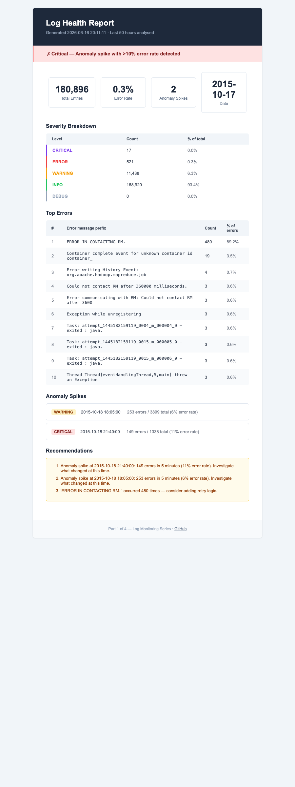

# Log Monitor — Health Check & Anomaly Detection

A Python pipeline that ingests real Hadoop cluster logs, detects error spikes using statistical thresholding, and delivers results through three channels: a FastAPI dashboard with live charts, a scheduled HTML email report, and a Slack alert system with deduplication.

The dataset is the [LogHub Hadoop corpus](https://github.com/logpai/loghub) — 180,896 real log entries from a YARN cluster running WordCount and PageRank jobs, with labeled failure scenarios including machine down, network disconnection, and disk full events.

---

## How it works

**Step 1 — Reading the logs**

`hadoop_loader.py` opens every log file in `sample_data/` and reads them line by line. Each line looks like:

```
2015-10-18 21:40:23  ERROR  Server: Could not contact ResourceManager
```

It pulls out four things from each line: the time, the severity level (INFO / WARNING / ERROR / FATAL), which part of the system wrote it, and the message. It collects all of this into a list — 180,896 lines total.

**Step 2 — Organising into a table**

`log_parser.py` turns that list into a pandas DataFrame. It adds two extra columns:

- **hour** — what hour of the day this happened (0–23), used for the hourly activity chart
- **minute_window** — the timestamp rounded down to the nearest 5 minutes. So 21:43 and 21:47 both become 21:40. This is how nearby events get grouped together for spike detection.

**Step 3 — Spotting the problem**

`analyser.py` looks at each 5-minute group and asks: out of all the log lines in this window, what percentage were errors?

Normally that's around 0.3%. But at 21:40 it's 11% — 35 times higher than baseline. That's a spike. Any window above 5% is flagged. Above 10% is critical.

**Step 4 — Three ways to tell someone**

Once the spikes are found, the project delivers that information three ways:

- **Email** (`run_report.py`) — builds an HTML email with a table of results and sends it to your inbox via Gmail. Like a morning newspaper for your server.
- **Dashboard** (`main.py`) — starts a web server. Open a browser at `localhost:8000` and see the charts live. The error timeline shows every 5-minute window as a bar — grey if normal, red if it spiked.
- **Slack** (`run_alert.py`) — posts a message to a Slack channel, but only when the status actually changes. It writes the current status (HEALTHY / WARNING / CRITICAL) to `state.json` after every check, reads it back next time, and stays silent if nothing changed. A 30-minute incident fires one alert, not six.

**The real data**

The logs come from a real university research cluster that ran Hadoop batch jobs. The researchers deliberately broke the cluster in different ways — turned off machines, filled up disks, cut the network — and saved the logs with labels. The errors in this project are real errors from real failures.

---

## Dashboard


The error timeline is the centrepiece — 5-minute windows plotted over the full log range. Grey bars are normal activity. Red bars are windows where the error rate crossed the 5% threshold. The two genuine failure events are immediately visible.

---

## What it detects

The pipeline detected two real anomalies from the labeled dataset:

| Time | Errors | Total entries | Error rate | Severity | Failure type |
|---|---|---|---|---|---|
| 2015-10-18 18:05 | 253 | 3,899 | 6% | WARNING | Disk full |
| 2015-10-18 21:40 | 149 | 1,338 | 11% | CRITICAL | Machine down |

Overall error rate across 48 hours: **0.3%** — making both spikes 20–35x deviations from baseline.

---

## Charts

### Severity Distribution


Breakdown of all 180,896 entries by log level. INFO dominates at 93.4%, which is expected for a healthy cluster — the 0.3% overall error rate confirms that errors are genuinely rare outside the failure windows.

### Hourly Activity


Log volume by hour of day, stacked by severity. The spike hours (18:00 and 21:00) show elevated WARNING and ERROR volumes compared to surrounding baseline hours.

### Top Errors


Most frequent error message prefixes. `ERROR IN CONTACTING RM` (ResourceManager) accounts for 480 occurrences — 89% of all errors — which is the signature of the machine-down failure scenario where YARN containers lose contact with the cluster manager.

### Email Report


The HTML email delivered by `run_report.py` on a schedule. Contains severity breakdown, top errors table, anomaly spike summary with severity badges, and plain-English recommendations. Renders correctly in Gmail, Outlook, and Apple Mail.

---

## Architecture

```
sample_data/           <- Real Hadoop cluster logs (180k entries, labeled failures)
    application_*/
        container_*.log

hadoop_loader.py       <- Parses Hadoop log format, maps WARN->WARNING / FATAL->CRITICAL
log_parser.py          <- to_dataframe(): adds hour, minute_window, is_error columns
analyser.py            <- count_by_severity(), detect_spikes(), generate_summary()
visualise.py           <- Four Matplotlib charts -> plots/*.png
email_builder.py       <- Self-contained HTML email with inline CSS
slack_sender.py        <- Slack Block Kit card builder + webhook POST

run_analysis.py        <- CLI: load -> parse -> analyse -> plot -> save JSON report
run_report.py          <- CLI: load -> analyse -> email (scheduled via GitHub Actions)
run_alert.py           <- CLI: load -> analyse -> Slack alert with deduplication
main.py                <- FastAPI app: serves dashboard + JSON API + plots
```

Three delivery paths from the same pipeline:

```
hadoop_loader -> to_dataframe -> analyser -> detect_spikes
                                                   |
               ┌───────────────────────────────────┼────────────────────────┐
               |                                   |                        |
         run_report.py                      run_analysis.py           run_alert.py
         (HTML email)                       (dashboard data)          (Slack + dedup)
```

---

## Slack alert deduplication

Without deduplication, a sustained failure at 21:40 would fire an alert every 5 minutes for as long as the incident lasted. The team would start ignoring the channel.

`state.json` solves this. After every check the script writes the current status to disk. Before firing it reads the previous status and compares. An alert fires **only when the status changes**:

```
HEALTHY  -> WARNING   fires  "Error rate elevated"
WARNING  -> CRITICAL  fires  "Escalating"
CRITICAL -> HEALTHY   fires  "System recovered"
WARNING  -> WARNING   silent
CRITICAL -> CRITICAL  silent
```

The Slack message is a Block Kit card with a coloured sidebar (green / amber / red), fields showing the worst window, error rate vs threshold, top error, and entry count, followed by a plain-English recommendation.

**Dry run — preview the payload without posting:**
```bash
python run_alert.py --dry-run
```

**Single check (CI / cron mode):**
```bash
python run_alert.py
```

**Daemon mode — runs every 5 minutes until killed:**
```bash
python run_alert.py --watch
```

---

## Spike detection logic

```python
# For each 5-minute window with >= 10 entries:
error_rate = error_count / total_entries

if error_rate > 0.05:        # above 5% -> spike
    if error_rate >= 0.10:   # above 10% -> critical
        severity = 'critical'
    else:
        severity = 'warning'
```

Thresholding on **rate** rather than raw count makes detection scale-invariant: 149 errors in 1,338 entries (11%) is far more alarming than 149 errors spread across 180,896 entries (0.08%).

The `min_window_entries = 10` filter eliminates sparse windows — a window with 1 entry and 1 error produces a 100% error rate but carries no statistical weight.

---

## Dataset

**Source:** [LogHub — Hadoop](https://github.com/logpai/loghub) (Zenodo, CC BY 4.0)

**Contents:** YARN container logs from WordCount and PageRank jobs run on a multi-node cluster. Both normal runs and runs with injected failures are included.

**Labeled failure types:**
- Machine down — nodes become unreachable mid-job
- Network disconnection — inter-node communication fails
- Disk full — output directory writes fail

**Log format:**
```
2015-10-18 21:40:23,154 ERROR [IPC Server handler 5] org.apache.hadoop.ipc.Server: IPC Server handler 5 on 8020 ...
```

`hadoop_loader.py` maps Java log levels to standard severity names:

| Hadoop | Internal |
|---|---|
| INFO | INFO |
| WARN | WARNING |
| ERROR | ERROR |
| FATAL | CRITICAL |

---

## API

| Method | Endpoint | Description |
|---|---|---|
| GET | `/` | Dashboard HTML |
| GET | `/health` | Service health check |
| GET | `/api/report` | Full analysis report as JSON |
| GET | `/api/severity-counts` | Entry counts by level |
| GET | `/api/top-errors` | Top error message prefixes |
| GET | `/api/spikes` | Detected anomaly spikes |
| POST | `/api/analyse` | Re-run full analysis pipeline |
| GET | `/plots/{filename}` | Serve a chart image |

---

## Running locally

**Requirements:** Python 3.11+

```bash
# 1. Clone and install
git clone https://github.com/xavier-oc-programming/log-monitor-health-check
cd log-monitor-health-check
pip install -r requirements.txt

# 2. Download the dataset (~48MB)
curl -L -o Hadoop.zip "https://zenodo.org/records/8196385/files/Hadoop.zip?download=1"
mkdir sample_data && unzip Hadoop.zip -d sample_data && rm Hadoop.zip

# 3. Copy config
cp config.yaml.example config.yaml

# 4. Run the analysis pipeline (generates plots and report)
python run_analysis.py

# 5. Start the dashboard
uvicorn main:app --reload
# -> http://localhost:8000
```

**Email report (dry run — no SMTP needed):**
```bash
export EMAIL_USERNAME=you@gmail.com
export EMAIL_PASSWORD=your-app-password
python run_report.py --dry-run
```

**Slack alert (dry run — no webhook needed):**
```bash
python run_alert.py --dry-run
```

**Preview the email HTML in your browser:**
```bash
python preview_email.py
```

---

## Configuration

`config.yaml.example` (copy to `config.yaml` — never commit this file):

```yaml
slack:
  webhook_url: ""   # set via SLACK_WEBHOOK_URL environment variable

analysis:
  error_rate_threshold: 0.05   # windows above this are flagged as spikes
  spike_window_minutes: 5      # aggregation window size in minutes
  min_window_entries: 10       # ignore windows with fewer entries than this
  top_errors_n: 10             # number of top errors to surface
```

All credentials come from environment variables — never from the config file:

```bash
export EMAIL_USERNAME=your@gmail.com
export EMAIL_PASSWORD=your-app-password
export EMAIL_TO=recipient@example.com
export EMAIL_FROM="Log Monitor <your@gmail.com>"
export SLACK_WEBHOOK_URL=https://hooks.slack.com/services/your/webhook/url
```

---

## CI/CD

Three GitHub Actions jobs in `.github/workflows/ci.yml`:

| Job | Trigger | What it does |
|---|---|---|
| `test` | Every push and PR | Runs `pytest tests/ -v` (22 tests) |
| `run_report` | Daily cron 08:00 UTC | Downloads dataset, runs email report + Slack alert |
| `deploy` | Push to main | Zips app and deploys to Azure App Service via Kudu zipdeploy |

Required GitHub secrets: `EMAIL_USERNAME`, `EMAIL_PASSWORD`, `EMAIL_TO`, `EMAIL_FROM`, `SLACK_WEBHOOK_URL`, `AZURE_CREDENTIALS`, `AZURE_APP_NAME`.

---

## Tech stack

| Layer | Technology |
|---|---|
| Language | Python 3.11 |
| Data processing | pandas |
| Charts | Matplotlib |
| API | FastAPI + Uvicorn |
| Email | smtplib (STARTTLS, port 587) |
| Slack | Block Kit via webhook (stdlib urllib only) |
| Config | PyYAML |
| Tests | pytest (22 tests) |
| Scheduling | GitHub Actions cron |
| Deployment | Docker, Azure App Service |
| Dataset | LogHub Hadoop (Zenodo CC BY 4.0) |

---

## Tests

```bash
pytest tests/ -v
```

22 tests across three files:

- **test_report.py** — config loading, Hadoop log parsing, DataFrame conversion, severity counts, spike detection, email building, dry-run
- **test_api.py** — all FastAPI endpoints, plot serving, path traversal blocking
- **test_alert.py** — Block Kit payload structure, colour coding per severity, transition text, deduplication (fires on change, silent on repeat), dry-run output

No network calls in tests — `send_alert` is monkeypatched. `test_hadoop_loader` reads real `sample_data/` and skips gracefully if not present.
